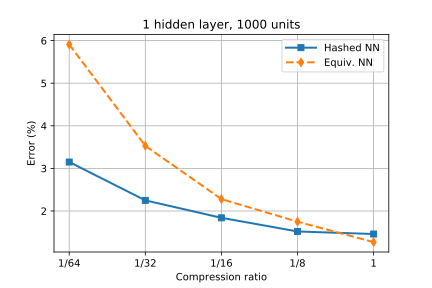

# HashedNets
This is a PyTorch implementation of [HashedNets](http://www.jmlr.org/proceedings/papers/v37/chenc15.pdf) by [Chen et al. (2015)](#References). The original authors  have published a (Lua)Torch implementation [here](https://www.cse.wustl.edu/~ychen/HashedNets/).

HashedNets implements parameter sharing by tying weights that collide in the same buckets given a hash function. The output dimensions of each layer remains the same, while the number of unique values in the weight matrices drop with the compression factor. The aim is to maintain performance as the model is compressed by making use of redundancy in the parameters. The benefit of using a hash function is that we only require the hash seed in order to record which parameters are tied, saving space.

## Example results on MNIST
This is an approximate reproduction of a figure from the original paper (produced in `example.ipynb`). Note that the results will be slightly different from the original paper given the different implementations, and the fact that I have not run Bayesian hyperparameter optimisation which they do in the paper or averaged over multiple runs.



## Dependencies
- [PyTorch](https://pytorch.org)
- [xxhash](https://pypi.org/project/xxhash/)
- [TorchVision](https://pytorch.org) (to run the MNIST example)

Tested with Python 3.6.8, PyTorch 1.0.1.post2, xxhash 1.3.0.

## Usage
The main component of interest is probably the `HashLinear` layer in `layers.py`. See `mnist.py` for an example model using the layer.

To see possible arguments to the script, run:
```sh
python3 mnist.py --help
```

To run the MNIST example with default hyperparameters, with or without hashing:
```sh
python3 mnist.py --compress 0.015625  # No hashing -> Test accuracy: 94.09%
python3 mnist.py --compress 0.015625 --hashed  # With hashing -> Test accuracy: 96.83%
```

## References
- Chen, W., Wilson, J., Tyree, S., Weinberger, K. and Chen, Y., 2015, June. [Compressing neural networks with the hashing trick](http://www.jmlr.org/proceedings/papers/v37/chenc15.pdf). In International Conference on Machine Learning (pp. 2285-2294).
